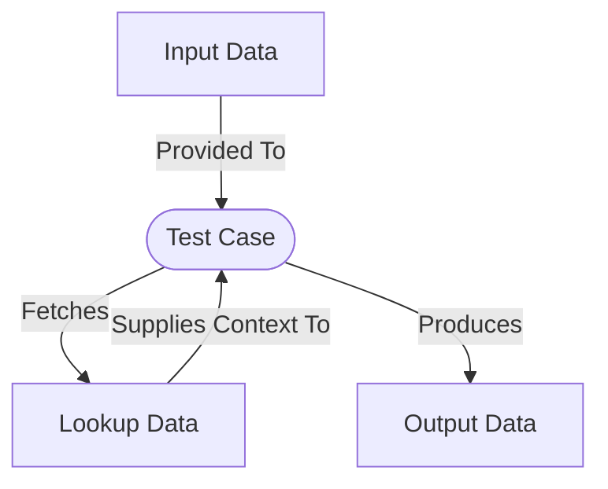

# Data Driven Tests

When developing Java applications, just like other programming languages, test cases are critical for ensuring the code functions as expected.  While writing test cases in JUnit as Java code is a common practice, a data driven approach can be an effective alternative for certain use cases.

A common patter for various types of tests is to have a set of input data, a set of expected output data, and a test case that can be run multiple times with different input data to validate the output data.  This is shown in the diagram below.

## UnitVectorY Libraries for Data Driven Testing

This pattern can be implemented in JUnit 5 using the `Parameterized` runner.  However, these parametrized test cases have their limitations.  Specifically, there is no built in mechanism for having a test that is for each file in a directory.

This is where [fileparamunit](https://github.com/UnitVectorY-Labs/fileparamunit) comes in.  This library allows for the creation of a test case that is run for each file in a directory.  The library is available on Maven Central.  This allows for test cases to be passed the path to each of these files allowing for custom logic for each file.

While this enables the pattern here, it isn't the logical conclusion.  A data driven test philosophy boils down to having the input be represented as JSON, specifying which context to utilize in the form of a JSON attribute, and the expected output being represented as JSON.  This is what [jsonparamunit](https://github.com/UnitVectorY-Labs/jsonparamunit) provides. This library is also available on Maven Central.  This allows for each file to be a JSON object with an "input", "context", and "output" provided the necessary inputs for the test cases.
